# [DRAGON BALL SERIES WEBSITE](https://sohailmehmood.github.io/Dragon-Ball-Series-Website)

Welcome to the Dragon Ball Series Website! This platform is dedicated to all Dragon Ball enthusiasts out there. Our goal is to provide a comprehensive, visually appealing experience to fans of the Dragon Ball series. Whether you're a seasoned fan or new to the series, this website is your one-stop destination for accessing information regarding each saga from each dragonball series.

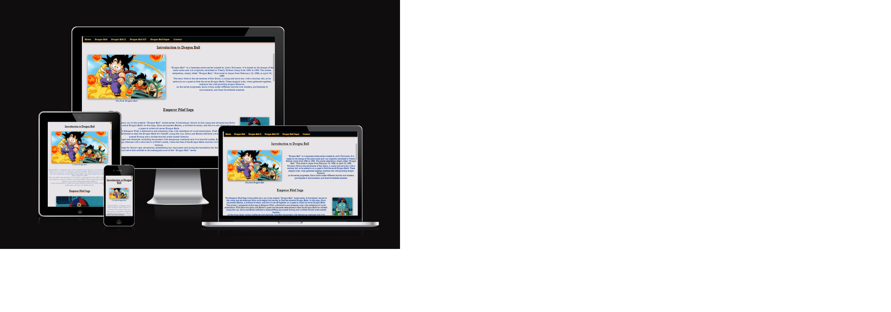

## UX

### Colour Scheme

The website employs a dynamic colour scheme to enhance the user experience:

- `#1c4595` used for primary text and navigation highlight.
- `#e76a24` used for secondary text, underlines and shadows.
- `#01080a` used for headers and shadows.
- `#e7e5e8` used for background color.
- `#fbbc42` used for navigation text and standard highlight.

I used [loading.io](https://loading.io/color/feature/DragonBall-%E3%83%89%E3%83%A9%E3%82%B4%E3%83%B3%E3%83%9C%E3%83%BC%E3%83%AB/) to generate my colour palette.

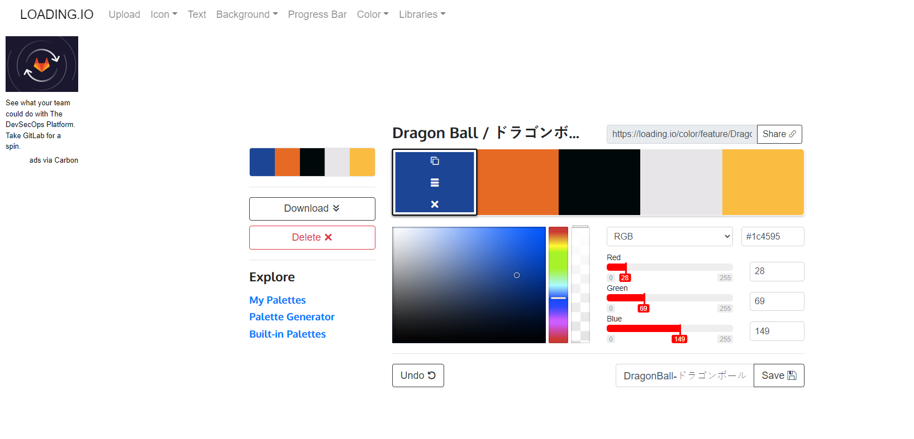

### Typography

- [Font Awesome](https://fontawesome.com) icons were used throughout the site, such as the social media icons in the footer.

## Wireframes

To follow best practice, wireframes were developed.
I've used [Balsamiq](https://balsamiq.com/wireframes) to design my site wireframes.

 Click here to see the Wireframes 

Home
  - 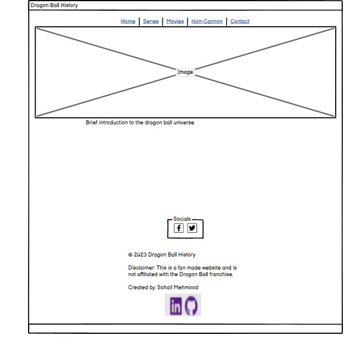

Dragon Ball
  - 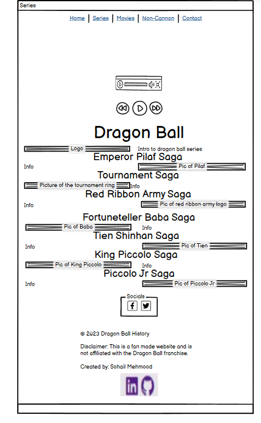

Dragon Ball Z
  - 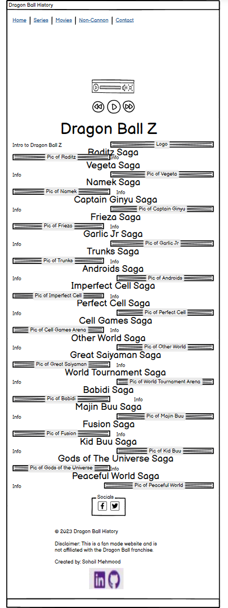

Dragon Ball GT
  - 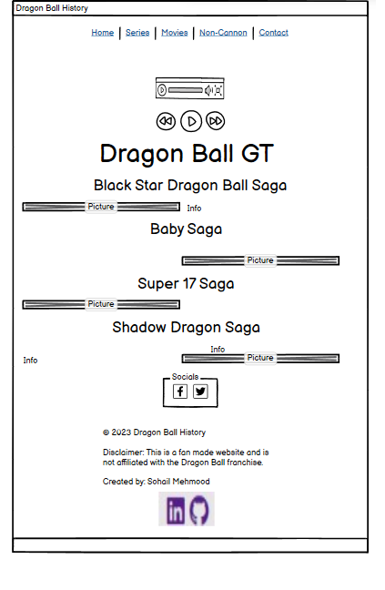

Dragon Ball Super
  - 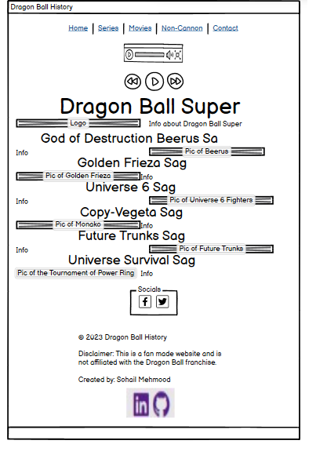

  Contact
  - 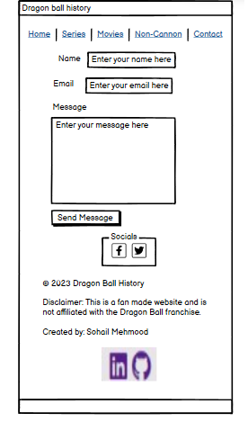

  Confirmation
  - 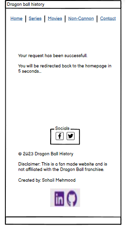

## Features

### Existing Features

- **Navigation bar**

    - The navigation bar is a critical website feature, providing users with a menu to easily navigate and access different sections.

- **Social Media**

    - Social media links in the footer, typically represented by icons, offer users quick access to dragonball social profiles. For users, social media links provide instant connection, enhanced engagement, and opportunities for content discovery. It also includes convenient links to the creator's LinkedIn and GitHub profiles, providing users with easy access to the creator's professional and coding profiles. 

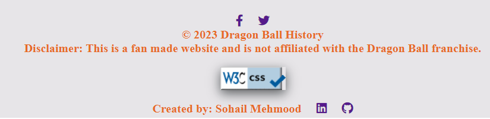

- **Home page**

    - The home page of a Dragon Ball website serves as the entry point, featuring a visually striking hero section. It offers a brief yet engaging introduction to Dragon Ball. This page enhances user engagement, reinforces the Dragon Ball brand, and provides quick access to different aspects of the series, making it an inviting and informative entry point for both newcomers and fans.

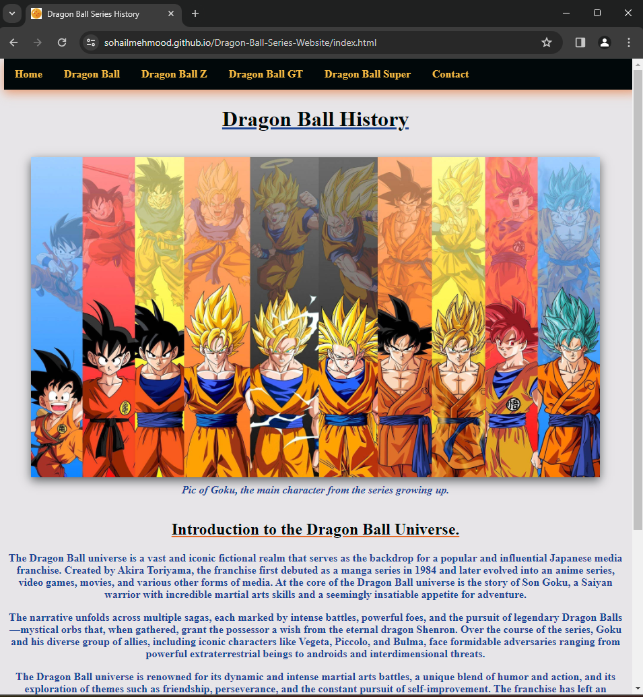

- **Dragonball page**

    - The Dragon Ball page offers an organized overview of the series' story arcs. Featuring visual representations and descriptions for each saga, the page aids in quick reference and enhances user understanding of the series' narrative structure.

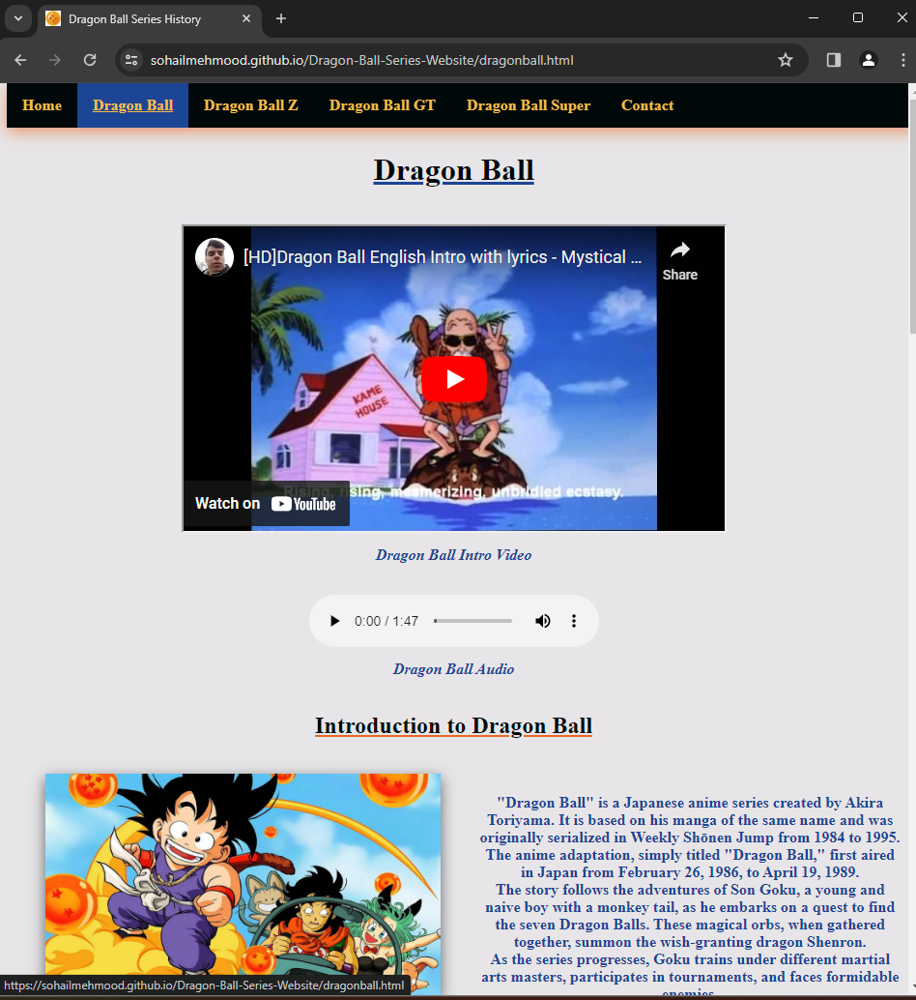

 - **Dragonball Z page**

    - The Dragon Ball Z page highlights story arcs from Dragon Ball Z with organized visuals and detailed descriptions. It offers a focused exploration of Dragon Ball Z, enhancing user engagement and providing a comprehensive hub for fans to deepen their understanding of the series.

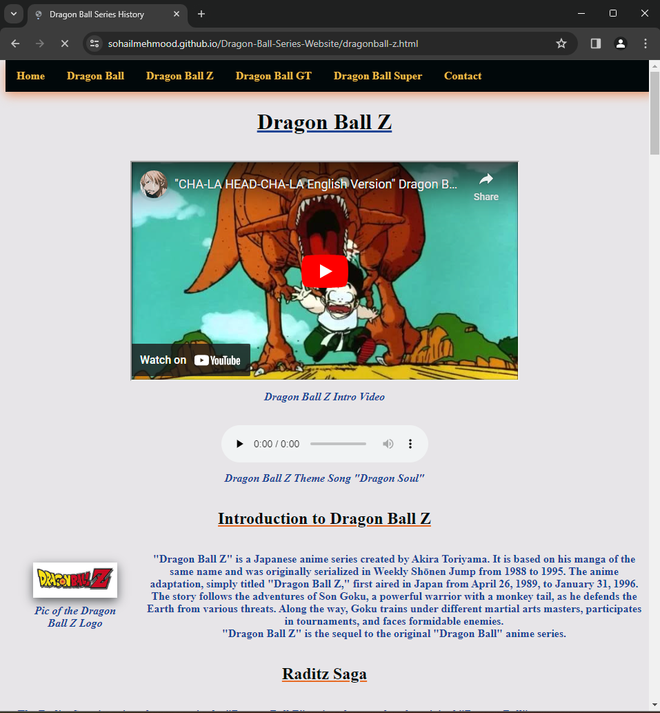

 - **Dragonball GT page**

    - The Dragon Ball GT page spotlights story arcs from Dragon Ball GT with organized visuals and detailed descriptions. It provides a dedicated space for fans to explore GT's unique sagas.

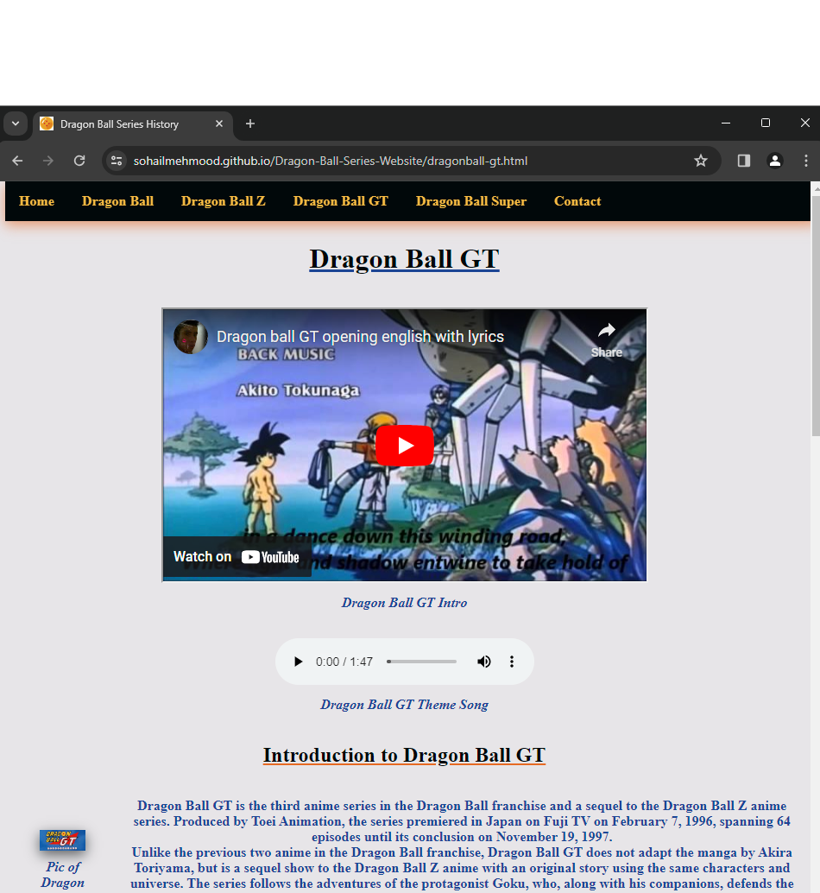

 - **Dragonball Super page**

    - The Dragon Ball Super page highlights story arcs from Dragon Ball Super, featuring organized visuals and detailed descriptions. It provides fans with a dedicated space to explore Super's unique sagas, encouraging engagement and offering a comprehensive hub for a deeper understanding.

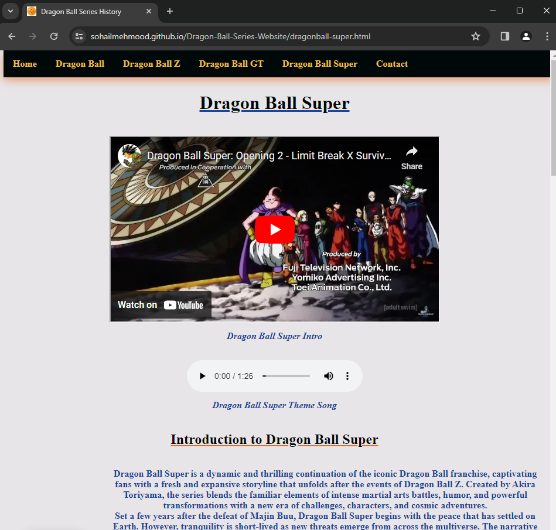

- **Contact page**

    - The Contact page facilitates direct communication with the website's creator. It includes a user-friendly form for sending messages, ensuring straightforward interaction and providing an accessible channel to connect with the creator.

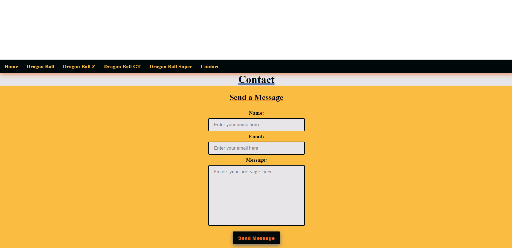

- **Confirmation page**

    - The Confirmation page assures users of a successful message submission to the website creator. It features a brief confirmation message and automatically redirects users to the home page after 5 seconds, ensuring a smooth and efficient user experience.

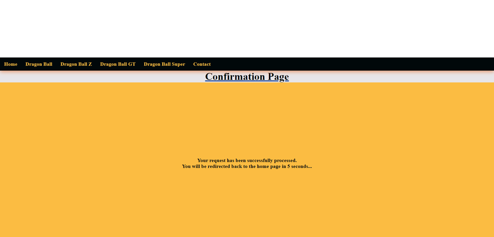

- **Youtube video**

    - Embedded YouTube videos of the intros for each series onto the series page. This provides users with a visually engaging and convenient way to preview the intro directly on the site.

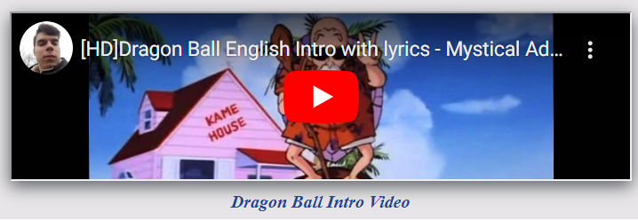

- **MP3 Audio intro**

    - Playable audio file which enables users to play embedded MP3 files of each Dragon Ball series' soundtrack directly on the relevant pages, enhancing the user experience.

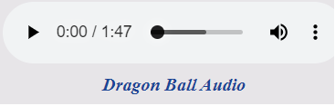

### Future Features

🛑🛑🛑🛑🛑 START OF NOTES (to be deleted) 🛑🛑🛑🛑🛑

Do you have additional ideas that you'd like to include on your project in the future?
Fantastic! List them here!
It's always great to have plans for future improvements!
Consider adding any helpful links or notes to help remind you in the future, if you revisit the project in a couple years.

🛑🛑🛑🛑🛑 END OF NOTES (to be deleted) 🛑🛑🛑🛑🛑

- Feature #1: Movie Showcase Page
    - Introduce a dedicated page for showcasing movies related to the Dragon Ball series. Include relevant details, summaries, and potentially embedded trailers or clips for an engaging user experience.
- Feature #2: Game Showcase Page
    - Implement a dedicated page highlighting Dragon Ball video games. Provide information on various games, including release dates, platforms, and potentially embed gameplay videos for user exploration.

## Tools & Technologies Used

- [HTML](https://en.wikipedia.org/wiki/HTML) used for the main site content.
- [CSS](https://en.wikipedia.org/wiki/CSS) used for the main site design and layout.
- [CSS Flexbox](https://www.w3schools.com/css/css3_flexbox.asp) used for an enhanced responsive layout.
- [Git](https://git-scm.com) used for version control. (`git add`, `git commit`, `git push`)
- [GitHub](https://github.com) used for secure online code storage.
- [GitHub Pages](https://pages.github.com) used for hosting the deployed front-end site.
- [Visual Studio Code](https://code.visualstudio.com) used as an IDE for development.
- [JPG to PNG](https://jpg2png.com) used to change img type.
- [Youtube to MP3](https://en.onlymp3.to/s16/) used to get audio from youtube video.

## Testing

For all testing, please refer to the [TESTING.md](TESTING.md) file.

## Deployment

The site was deployed to GitHub Pages. 

The live link can be found [here](https://sohailmehmood.github.io/Dragon-Ball-Series-Website)

### Local Deployment

This project can be cloned or forked in order to make a local copy on your own system.

#### Cloning

You can clone the repository by following these steps:

1. Go to the [GitHub repository](https://github.com/SohailMehmood/Dragon-Ball-Series-Website) 
2. Locate the Code button above the list of files and click it 
3. Select if you prefer to clone using HTTPS, SSH, or GitHub CLI and click the copy button to copy the URL to your clipboard
4. Open Git Bash or Terminal
5. Change the current working directory to the one where you want the cloned directory
6. In your IDE Terminal, type the following command to clone my repository:
	- `git clone https://github.com/SohailMehmood/Dragon-Ball-Series-Website.git`
7. Press Enter to create your local clone.

Alternatively, if using Gitpod, you can click below to create your own workspace using this repository.

Please note that in order to directly open the project in Gitpod, you need to have the browser extension installed.
A tutorial on how to do that can be found [here](https://www.gitpod.io/docs/configure/user-settings/browser-extension).

#### Forking

By forking the GitHub Repository, we make a copy of the original repository on our GitHub account to view and/or make changes without affecting the original owner's repository.
You can fork this repository by using the following steps:

1. Log in to GitHub and locate the [GitHub Repository](https://github.com/SohailMehmood/Dragon-Ball-Series-Website)
2. At the top of the Repository (not top of page) just above the "Settings" Button on the menu, locate the "Fork" Button.
3. Once clicked, you should now have a copy of the original repository in your own GitHub account!

## Credits

### Content

| Source | Location | Notes |
| --- | --- | --- |
| [Markdown Builder](https://tim.2bn.dev/markdown-builder) | README and TESTING | tool to help generate the Markdown files |
| [Flexbox Froggy](https://flexboxfroggy.com/) | entire site | modern responsive layouts |
| [DragonBall Fandom](https://dragonball.fandom.com/wiki/List_of_Sagas) | List of Sags | used to source information about the order of sagas |

### Media

| Source | Location | Type | Notes |
| --- | --- | --- | --- |
| [Goku Growing Up](https://www.reddit.com/r/FortNiteBR/comments/wjfzo3/when_will_dragon_ball_skins_release/) | home page | image | hero image background |
| [Dragon Ball](https://static.wikia.nocookie.net/5d8ce090-629e-44be-b59e-65e4220697d6/scale-to-width/755) | dragonball page | image | dragonball picture |
| [Pilaf](https://dragonballupdates.fandom.com/wiki/Emperor_Pilaf) | dragonball page | image | pic of pilaf |
| [Tournament](https://wallpapers.com/picture/goku-pictures-59daze7xqbps7r3p.html) | dragonball page | image | pic of kid goku in tournament |
| [Red Ribbon](https://www.artstation.com/artwork/red-ribbon-army) | dragonball page | image | pic of the red ribbon army |
| [Fortune Teller Baba](https://dragonball.fandom.com/wiki/Fortuneteller_Baba) | dragonball page | image | pic of forune teller baba |
| [Tien](https://www.flickr.com/photos/58963067@N02/5424938824) | dragonball page | image | pic of tien |
| [King Piccolo](https://universal-dragon-ball.fandom.com/wiki/Goku_vs._King_Piccolo%253A_Rematch) | dragonball page | image | pic of king piccolo |
| [Piccolo Jr](https://www.deviantart.com/gamefreak2008/art/Young-Piccolo-s-Revenge-116821751) | dragonball page | image | pic of piccolo jr |
| [Dragon Ball Intro Audio](https://www.televisiontunes.com/Dragon_Ball_-_English.html) | dragonball page | audio | dragon ball intro |
| [Dragon Ball Intro Video](https://www.youtube.com/watch?v%253DROnd7d4axHo) | dragonball page | video | dragonball intro |
| [Dragon Ball Z](https://ultradragonball.fandom.com/wiki/Dragon_Ball_Z) | dragonball z page | image | pic of the dragon ball z logo |
| [Raditz](https://www.flickr.com/photos/21601093%2540N04/3330869474/) | dragonball z page | image | pic of raditz |
| [Vegeta](https://dragonball.fandom.com/f/p/4400000000000186542/r/4400000000000772616) | dragonball z page | image | pic of vegeta |
| [Namek](https://wallpapers.com/images/high/namek-1080-x-1920-wallpaper-c7aepqwbbcg6nqle.webp) | dragonball z page | image | pic of planet namek landscape |
| [Ginyu Force](https://www.ign.com/wikis/dragon-ball-fighterz/Captain_Ginyu) | dragonball z page | image | pic of captain ginyu and the ginyu force |
| [Frieza](https://dragonballworld.fandom.com/wiki/Freeza) | dragonball z page | image | pic of frieza |
| [Garlic Jr](https://coub.com/view/18n4ql) | dragonball z page | image | pic of garlic jr |
| [Trunks](https://wallpapers.com/trunks-phone) | dragonball z page | image | pic of trunks |
| [Androids](https://wallpapers.com/wallpapers/dragon-ball-characters-900-x-1200-wallpaper-aw6vh7unaly8eh70.html) | dragonball z page | image | pic of androids 17 and 18 |
| [Imperfect](https://www.deviantart.com/greytonano/art/Cell-JR-Imperfect-673888972) | dragonball z page | image | pic of imperfect cell |
| [Perfect](https://www.hiclipart.com/free-transparent-background-png-clipart-mardx) | dragonball z page | image | pic of perfect cell |
| [Cell Games](https://dragonballfighterz.fandom.com/wiki/Cell_Games_Arena) | dragonball z page | image | pic of the cell games arena |
| [Other World](https://wallpapers.com/wallpapers/goku-ssj3-jztrikiyg7xd3td0.html) | dragonball z page | image | pic of goku as ssj3 in other world |
| [Great Saiyaman](https://hero.fandom.com/wiki/Gohan) | dragonball z page | image | pic of the great saiyaman |
| [World Tournament](https://dragonball.fandom.com/wiki/World_Martial_Arts_Tournament) | dragonball z page | image | pic of the world martial arts tournament arena |
| [Babidi](https://www.deviantart.com/tag/babidi?page%253D5) | dragonball z page | image | pic of babidi |
| [Majin Buu](https://www.flickr.com/photos/26824605%2540N03/2536067446) | dragonball z page | image | pic of majin buu |
| [Fusion](https://www.thegamer.com/dragon-ball-ridiculous-storylines-fans-forget/) | dragonball z page | image | pic of fusion |
| [Kid Buu](https://dragonball.fandom.com/wiki/Dragon_Ball_Z%253A_Season_9_%2528Quotes%2529) | dragonball z page | image | pic of kid buu |
| [Peaceful World](https://dragon-ball-sf-universe.fandom.com/wiki/Peaceful_World_Saga) | dragonball z page | image | pic of the peaceful world |
| [Dragon Ball Z Intro Audio](https://www.televisiontunes.com/Dragon_Ball_Z_Kai_-_Dragon_Soul.html) | dragonball z page | audio | dragonball z intro |
| [Dragon Ball Z Intro Video](https://www.youtube.com/watch?v%253D-OyWMUaRsUc) | dragonball z page | video | dragonball z intro |
| [Gt](https://upload.wikimedia.org/wikipedia/pt/9/92/DBGTLogo.png) | dragonball gt page | image | dragonball gt logo |
| [Black Star](https://www.istockphoto.com/photo/four-star-dragonball-gm621132178-108411425) | dragonball gt page | image | pic of the black 4 star dragonball |
| [Baby](https://upload.wikimedia.org/wikipedia/it/1/11/Baby_Vegeta.png) | dragonball gt page | image | pic of baby |
| [Super 17](https://www.flickr.com/photos/camusnosaint18/3162006542) | dragonball gt page | image | pic of super 17 |
| [Shadow Dragons](https://www.flickr.com/photos/varon-fantasma/4686717680) | dragonball gt page | image | pic of the shadow dragons |
| [Dragon Ball GT Intro Video](https://www.youtube.com/watch?v%253DTmGgBJSzCSM) | dragonball gt page | video | dragonball gt intro |
| [Dragon Ball Gt Intro Audio](https://www.televisiontunes.com/Dragon_Ball_GT_-_Opening_by_Zard.html) | dragonball gt page | audio | dragonball gt intro |
| [Super Logo](https://upload.wikimedia.org/wikipedia/it/3/3d/Dragon_Ball_Super_logo.png) | dragonball super page | image | pic of the dragonball super logo |
| [Beerus](https://www.deviantart.com/themarioman56/art/Beerus-795380783) | dragonball super page | image | pic of beerus |
| [Golden Frieza](https://wallpapers.com/wallpapers/golden-frieza-unleashing-power-k0cv7thbk841qugt.html) | dragonball super page | image | pic of golden frieza |
| [Champa](https://www.deviantart.com/naironkr/art/champa-god-of-destruction-575497725) | dragonball super page | image | pic of champa |
| [Copy Vegeta](https://www.deviantart.com/obsolete00/art/Copy-Vegeta-Dragon-Ball-Super-667541208) | dragonball super page | image | pic of copy vegeta |
| [Goku Black](https://upload.wikimedia.org/wikipedia/pt/b/b6/Black%2526Zamasu.png) | dragonball super page | image | pic of goku black and zamasu |
| [Tournament of Power](https://www.deviantart.com/asait1990/art/Dragon-Ball-Super-Tournament-Of-Power-Arena-712312448) | dragonball super page | image | pic of the tournament of power arena |
| [Dragon Ball Super Intro Video](https://www.youtube.com/watch?v%253DvWtOP721n0s) | dragonball super page | video | dragonball super intro |
| [Dragon Ball Super Intro Audio](https://www.youtube.com/watch?v%253D0LvIB2MOLnY) | dragonball super page | audio | dragonball super intro |

### Acknowledgements

- I would like to thank my Code Institute mentor, [Tim Nelson](https://github.com/TravelTimN) for their support throughout the development of this project.
- I would like to thank the [Code Institute](https://codeinstitute.net) tutor team for their assistance with troubleshooting and debugging some project issues.
- I would like to thank the [Code Institute Slack community](https://code-institute-room.slack.com) for the moral support; it kept me going during periods of self doubt and imposter syndrome.
