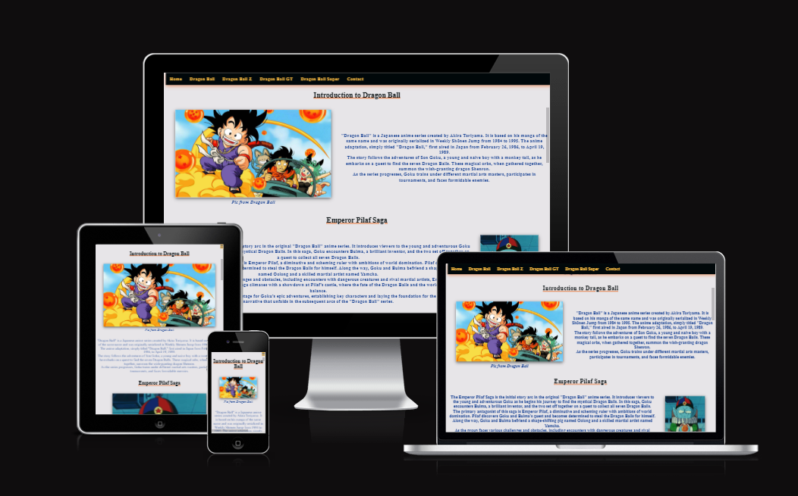

# [DRAGON BALL SERIES WEBSITE](https://sohailmehmood.github.io/Dragon-Ball-Series-Website)

Welcome to the Dragon Ball Series Website! This platform is dedicated to all Dragon Ball enthusiasts out there. Our goal is to provide a comprehensive, visually appealing experience to fans of the Dragon Ball series. Whether you're a seasoned fan or new to the series, this website is your one-stop destination for accessing information regarding each saga from each dragonball series.

## UX

### Colour Scheme

The website employs a dynamic colour scheme to enhance the user experience:

- `#1c4595` used for primary text and navigation highlight.
- `#e76a24` used for secondary text, underlines and shadows.
- `#01080a` used for headers and shadows.
- `#e7e5e8` used for background color.
- `#fbbc42` used for navigation text and standard highlight.

I used [loading.io](https://loading.io/color/feature/DragonBall-%E3%83%89%E3%83%A9%E3%82%B4%E3%83%B3%E3%83%9C%E3%83%BC%E3%83%AB/) to generate my colour palette.

### Typography

- [Font Awesome](https://fontawesome.com) icons were used throughout the site, such as the social media icons in the footer.

## Wireframes

To follow best practice, wireframes were developed.
I've used [Balsamiq](https://balsamiq.com/wireframes) to design my site wireframes.

 Click here to see the Wireframes 

Home
  - 

Dragon Ball
  - 

Dragon Ball Z
  - 

Dragon Ball GT
  - 

Dragon Ball Super
  - 

  Contact
  - 

  Confirmation
  - 

## Tools & Technologies Used

- [HTML](https://en.wikipedia.org/wiki/HTML) used for the main site content.
- [CSS](https://en.wikipedia.org/wiki/CSS) used for the main site design and layout.
- [CSS Flexbox](https://www.w3schools.com/css/css3_flexbox.asp) used for an enhanced responsive layout.
- [Git](https://git-scm.com) used for version control. (`git add`, `git commit`, `git push`)
- [GitHub](https://github.com) used for secure online code storage.
- [GitHub Pages](https://pages.github.com) used for hosting the deployed front-end site.
- [Visual Studio Code](https://code.visualstudio.com/) used as an IDE for development.

## Testing

For all testing, please refer to the [TESTING.md](TESTING.md) file.

## Deployment

The site was deployed to GitHub Pages. 

The live link can be found [here](https://sohailmehmood.github.io/Dragon-Ball-Series-Website)

### Local Deployment

This project can be cloned or forked in order to make a local copy on your own system.

#### Cloning

You can clone the repository by following these steps:

1. Go to the [GitHub repository](https://github.com/SohailMehmood/Dragon-Ball-Series-Website) 
2. Locate the Code button above the list of files and click it 
3. Select if you prefer to clone using HTTPS, SSH, or GitHub CLI and click the copy button to copy the URL to your clipboard
4. Open Git Bash or Terminal
5. Change the current working directory to the one where you want the cloned directory
6. In your IDE Terminal, type the following command to clone my repository:
	- `git clone https://github.com/SohailMehmood/Dragon-Ball-Series-Website.git`
7. Press Enter to create your local clone.

Alternatively, if using Gitpod, you can click below to create your own workspace using this repository.

Please note that in order to directly open the project in Gitpod, you need to have the browser extension installed.
A tutorial on how to do that can be found [here](https://www.gitpod.io/docs/configure/user-settings/browser-extension).

#### Forking

By forking the GitHub Repository, we make a copy of the original repository on our GitHub account to view and/or make changes without affecting the original owner's repository.
You can fork this repository by using the following steps:

1. Log in to GitHub and locate the [GitHub Repository](https://github.com/SohailMehmood/Dragon-Ball-Series-Website)
2. At the top of the Repository (not top of page) just above the "Settings" Button on the menu, locate the "Fork" Button.
3. Once clicked, you should now have a copy of the original repository in your own GitHub account!

## Credits

### Content

| Source | Location | Notes |
| --- | --- | --- |
| [Markdown Builder](https://tim.2bn.dev/markdown-builder) | README and TESTING | tool to help generate the Markdown files |
| [Flexbox Froggy](https://flexboxfroggy.com/) | entire site | modern responsive layouts |
| [DragonBall Fandom](https://dragonball.fandom.com/wiki/List_of_Sagas) | List of Sags | used to source information about the order of sagas |

### Media

| Source | Location | Type | Notes |
| --- | --- | --- | --- |
| [Lorem Picsum](https://picsum.photos) | home page | image | hero image background |
| [Unsplash](https://unsplash.com) | product page | image | sample of fake products |
| [Pixabay](https://pixabay.com) | gallery page | image | group of photos for gallery |
| [Wallhere](https://wallhere.com) | footer | image | background wallpaper image in the footer |
| [This Person Does Not Exist](https://thispersondoesnotexist.com) | testimonials | image | headshots of fake testimonial images |
| [Audio Micro](https://www.audiomicro.com/free-sound-effects) | game page | audio | free audio files to generate the game sounds |
| [Videvo](https://www.videvo.net/) | home page | video | background video on the hero section |
| [TinyPNG](https://tinypng.com) | entire site | image | tool for image compression |

### Acknowledgements

- I would like to thank my Code Institute mentor, [Tim Nelson](https://github.com/TravelTimN) for their support throughout the development of this project.
- I would like to thank the [Code Institute](https://codeinstitute.net) tutor team for their assistance with troubleshooting and debugging some project issues.
- I would like to thank the [Code Institute Slack community](https://code-institute-room.slack.com) for the moral support; it kept me going during periods of self doubt and imposter syndrome.
