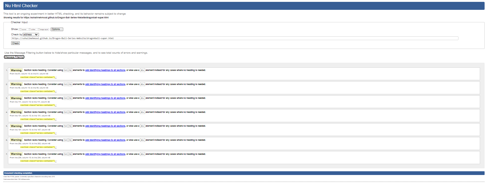

# Testing

Return back to the [README.md](README.md) file.

## Code Validation

### HTML

I have used the recommended [HTML W3C Validator](https://validator.w3.org) to validate all of my HTML files.

| Page | W3C URL | Screenshot | Notes |
| --- | --- | --- | --- |
| Home | [W3C](https://validator.w3.org/nu/?doc=https%3A%2F%2Fsohailmehmood.github.io%2FDragon-Ball-Series-Website%2Findex.html) |  | Pass: No Errors |
| Dragonball | [W3C](https://validator.w3.org/nu/?doc=https%3A%2F%2Fsohailmehmood.github.io%2FDragon-Ball-Series-Website%2Fdragonball.html) |  | Section Lack Heading Warnings |
| Dragonball Z | [W3C](https://validator.w3.org/nu/?doc%253Dhttps%253A%252F%252Fsohailmehmood.github.io%252FDragon-Ball-Series-Website%252Fdragonball-z.html) |  | Section Lack Heading Warnings |
| Dragonball GT | [W3C](https://validator.w3.org/nu/?doc%253Dhttps%253A%252F%252Fsohailmehmood.github.io%252FDragon-Ball-Series-Website%252Fdragonball-gt.html) |  | Section Lack Heading Warnings |
| Dragonball Super | [W3C](https://validator.w3.org/nu/?doc%253Dhttps%253A%252F%252Fsohailmehmood.github.io%252FDragon-Ball-Series-Website%252Fdragonball-super.html) |  | Section Lack Heading Warnings |
| Contact | [W3C](https://validator.w3.org/nu/?doc%253Dhttps%253A%252F%252Fsohailmehmood.github.io%252FDragon-Ball-Series-Website%252Fcontact.html) |  | Pass: No Errors |
| Confirmation | [W3C](https://validator.w3.org/nu/?doc%253Dhttps%253A%252F%252Fsohailmehmood.github.io%252FDragon-Ball-Series-Website%252Fconfirmation.html%253Fname%253DSohail%2526email%253Dsohail_mehmood%252540hotmail.com%2526message%253Ddsa) |  | Pass: No Errors |

### CSS

I have used the recommended [CSS Jigsaw Validator](https://jigsaw.w3.org/css-validator) to validate all of my CSS files.

| File | Jigsaw URL | Screenshot | Notes |
| --- | --- | --- | --- |
| style.css | [Jigsaw](https://jigsaw.w3.org/css-validator/validator?uri%253Dhttps%253A%252F%252Fsohailmehmood.github.io%252FDragon-Ball-Series-Website%252Findex.html%2526profile%253Dcss3svg%2526usermedium%253Dall%2526warning%253D1%2526vextwarning%253D%2526lang%253Den) |  | Pass: No Errors |

## Browser Compatibility

I've tested my deployed project on multiple browsers to check for compatibility issues.

| Browser | Home | About | Contact | etc | Notes |
| --- | --- | --- | --- | --- | --- |
| Chrome |  |  |  |  | Works as expected |
| Firefox |  |  |  |  | Works as expected |
| Edge |  |  |  |  | Works as expected |
| Opera |  |  |  |  | Minor differences |
| repeat for any other tested browsers | x | x | x | x | x |

## Responsiveness

I've tested my deployed project on multiple devices to check for responsiveness issues.

| Device | Home | Dragon Ball | Dragon Ball Z | Dragon Ball GT | Dragon Ball Super | Contact | Notes |
| --- | --- | --- | --- | --- | --- | --- | --- |
| Mobile (DevTools) |  |  |  |  |  |  | Works as expected |
| Desktop |  |  |  |  |  |  | Works as expected |
| 4K Monitor |  |  |  |  |  |  | Noticeable scaling issues |

## Lighthouse Audit

🛑🛑🛑🛑🛑 START OF NOTES (to be deleted) 🛑🛑🛑🛑🛑

Use this space to discuss testing the live/deployed site's Lighthouse Audit reports.
Avoid testing the local version (especially if developing in Gitpod), as this can have knock-on effects of performance.

If you don't have Lighthouse in your Developer Tools,
it can be added as an [extension](https://chrome.google.com/webstore/detail/lighthouse/blipmdconlkpinefehnmjammfjpmpbjk).

Don't just test the home page (unless it's a single-page application).
Make sure to test the Lighthouse Audit results for all of your pages.

**IMPORTANT**: You must provide screenshots of the results, to "prove" that you've actually tested them.

Sample Lighthouse testing documentation:

🛑🛑🛑🛑🛑 END OF NOTES (to be deleted) 🛑🛑🛑🛑🛑

I've tested my deployed project using the Lighthouse Audit tool to check for any major issues.

| Page | Mobile | Desktop | Notes |
| --- | --- | --- | --- |
| Home |  |  | Some minor warnings |
| About |  |  | Some minor warnings |
| Gallery |  |  | Slow response time due to large images |
| x | x | x | repeat for any other tested pages/sizes |

